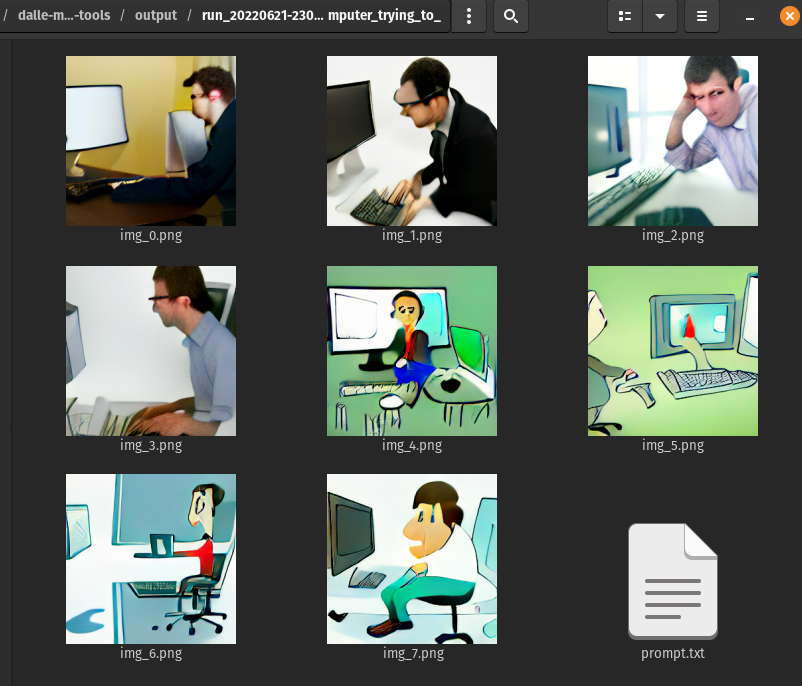

# dalle-mini-tools
A (soon-to-be) collection of tools for generating [dalle-mini](https://github.com/borisdayma/dalle-mini) images 

# Installation & Usage
Install the dependencies, then try out the basebones CLI. Try `python cli.py --help` for options like saving a wandb run.

```
pip install -r requirements.txt
python cli.py "a man at a computer trying to generate images"
```

and if everything runs OK, you should get images in an `output` directory. Like:
<br/><br/>



# Purpose
This is repository is a collection of tools for doing inference against dalle-mini and dalle-mega.


# What is in this project?
To date, the project contains:

* __`generate.py`__ is a command-line interface for generating images. This has no dependencies.
* __`sitegen.py`__ is a static website generator that uses `templates/template.html` to create index pages per the specified `output_dir` so you can upload results to a webserver
* __`server.py`__ is a Flask web server to host requests. This depends the `request.py` library and on having a `worker.py` running since requests are queued into an SQS queue.
* __`worker.py`__ is a worker process that listens to a SQS queue and then runs the model (via `generate.py`)
* __`request.py`__ is a command-line tool (and library used by `server.py`) for sending requests to the SQS queue. The server depends on this.

More to come...

